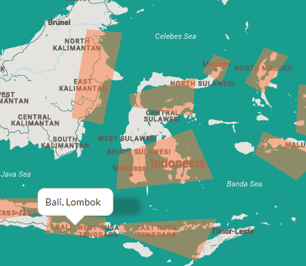
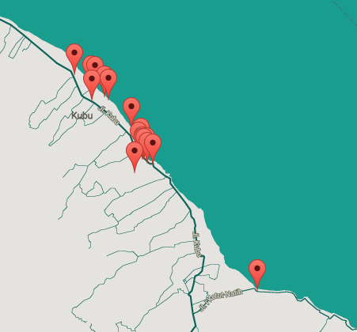
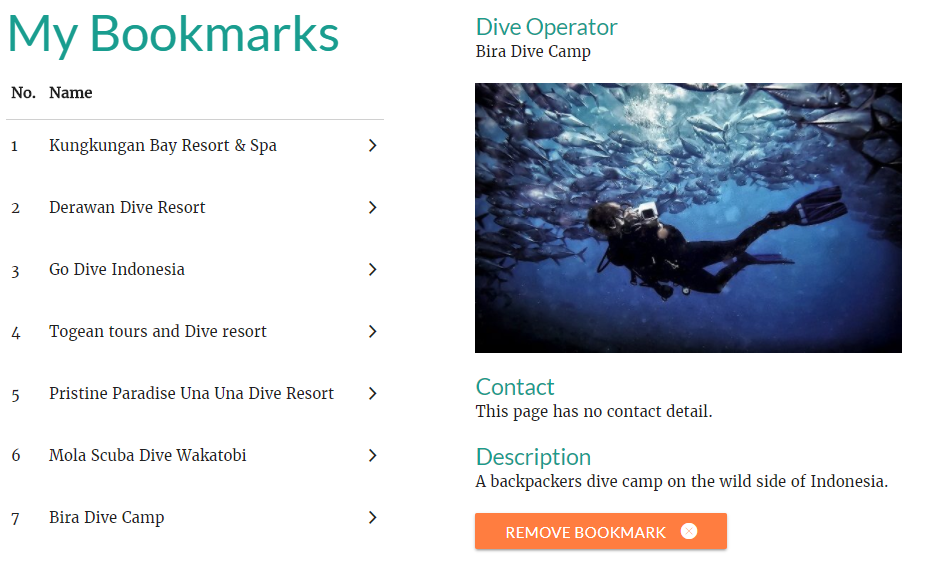

# FindingBlu
- a web app that shows the location of all dive operators in Indonesia, categorised according to popular dive regions and then further into dive spots

## Features
- Facebook's Graph api, FB auth
- Google Maps api
- Flickr api
- MySQL / AWS

## Screenshots

## Contributors
- 2 person team over 40 days
- [original repo] (https://bitbucket.org/ycy88/awesome)

## Notes
1. dev
    - path: /prep/map/config/development-cloud.js

2. production
    - Set env NODE_PORT 
    - Set env NODE_ENV
    - path: /prep/map/config/production.js
